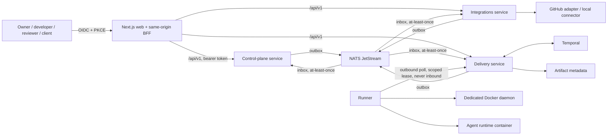
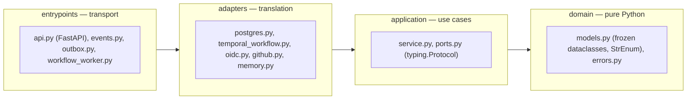
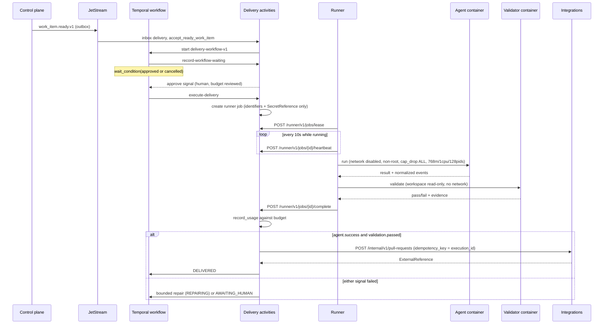
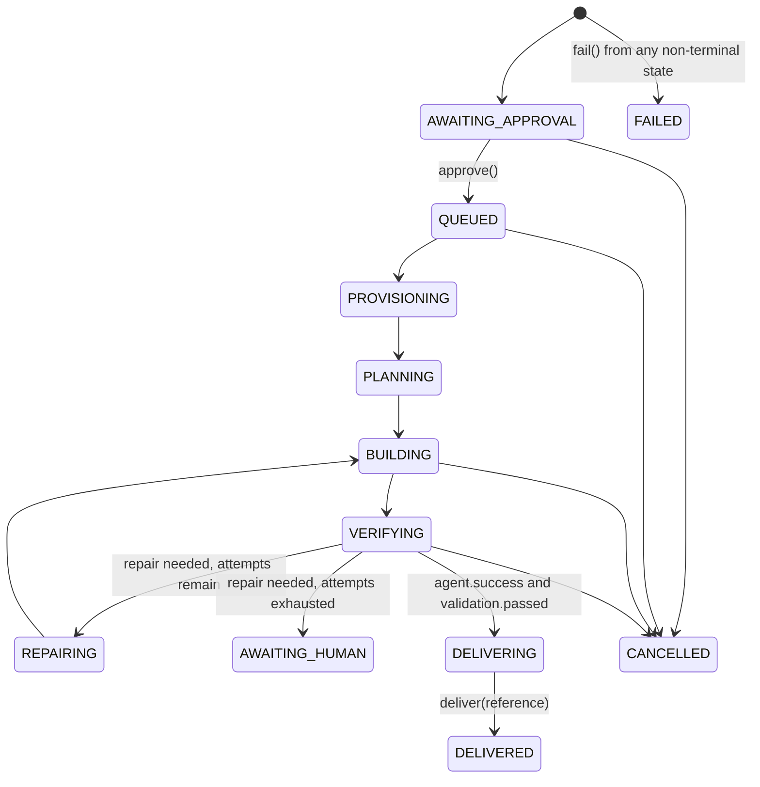
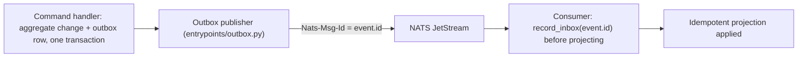

# MVP Master

MVP Master is a multi-tenant platform that turns reviewed client requirements into
independently verified repository changes, delivered through a coding agent it does
not trust by default.

The load-bearing rule is simple to state and deliberately hard to bypass: **an agent's
claim of success is never accepted as evidence.** Every attempt runs in an isolated,
network-disabled container; a second, read-only, no-network container independently
re-runs validation; delivery requires both signals to agree. The canonical domain does
not know what GitHub, Docker, Temporal, or any agent provider is — those enter only
through explicit ports, so a provider, runtime, model, and authentication mode can be
swapped without touching business rules, and never fall back to one another silently.

The repository is under active construction. [Implemented scope](docs/implemented-scope.md)
is the exact, current capability inventory and takes precedence over any framing below.

## Table of contents

- [What it does](#what-it-does)
- [Architecture](#architecture)
- [Engineering decisions](#engineering-decisions)
- [Security model](#security-model)
- [Implementation status](#implementation-status)
- [Getting started](#getting-started)
- [Repository layout](#repository-layout)
- [Quality gates](#quality-gates)
- [Documentation index](#documentation-index)

## What it does

The first implemented product path is intentionally narrow, and every step below is
exercised end to end by the checked-in Playwright scenario
(`apps/web/tests/e2e/vertical-slice.spec.ts`):

1. Authenticate through OIDC and create an organization and project.
2. Connect a repository through the production connector port (the shipped default
   is a clearly labeled local substitute, not a real GitHub App installation).
3. Submit structured intake and approve an immutable specification version.
4. Review a generated work item and ready it with an explicit agent provider, runner
   pool, and cost/turn/duration budget.
5. Approve the execution. It runs in an isolated workspace, is independently
   validated, and produces a commit plus a pull request reference.
6. Review the execution timeline, verification evidence, accumulated cost, and audit
   history.

Real GitHub App and Codex adapters are opt-in and are never substituted silently for
the development defaults — see [Implementation status](#implementation-status).

## Architecture

### System context



The runner never receives inbound connections: it polls delivery outbound and holds
only a scoped, expiring job lease. No component mounts the host Docker socket.

### Bounded contexts

| Context | Owns | Database |
|---|---|---|
| **Control plane** | Tenant identity projections, memberships, projects, intake, specification versions, work items, cross-service audit read model | `control_plane` |
| **Integrations** | Connector installations, authorized repositories, webhook deliveries, external references, provider operations | `integrations` |
| **Delivery** | Provider configurations, secret references, budgets, runner pools, executions/attempts, verification evidence, costs, delivery results | `delivery` |
| **Runner** | Independently deployable; local agent availability, secret resolution, isolated workspaces, normalized events, cleanup | none (stateless worker) |

Each service owns its database and Alembic history; none reads or writes another
service's tables (`AGENTS.md`).

### Hexagonal layering

Every Python deployable — the three services and the runner — is organized the same
way, and the dependency direction is enforced by convention and reviewed on every
change, not just documented:



Domain and application code must not import FastAPI, SQLAlchemy, Temporal, NATS,
Docker, GitHub, or any model-provider SDK — those live only in adapters, behind ports
defined as `Protocol`s (e.g. `runners/docker_runner/src/mvp_runner/application/ports.py`
defines `AgentRuntime`, `Validator`, `SecretResolver`, `WorkspaceManager`).

### Execution flow

The sequence below is the actual path from a `work_item.ready.v1` event to a
delivered pull request, traced from
`services/delivery/src/mvp_delivery/adapters/activities.py`,
`services/delivery/src/mvp_delivery/adapters/temporal_workflow.py`, and
`runners/docker_runner/src/mvp_runner/entrypoints/daemon.py`.



Jobs carry identifiers, the selected runtime/model/authentication mode, and a
`SecretReference` — never a secret value. Delivery only learns whether validation
passed; it never sees agent-generated content as proof of anything.

### Execution state machine

Transitions are guarded commands on the `Execution` aggregate
(`services/delivery/src/mvp_delivery/domain/models.py`); nothing outside the domain
can set `status` directly.



### Event flow



Delivery is **at-least-once, not exactly-once** (ADR 0003); every consumer stores the
event ID in an inbox before applying its effect, so replays and reordering cannot
double-apply state.

## Engineering decisions

Full rationale lives in [`docs/adrs/`](docs/adrs); this is why each holds, in prose.

- **Hexagonal layering in every deployable** ([ADR 0002](docs/adrs/0002-hexagonal-architecture.md)).
  Provider and infrastructure replacements — a new agent runtime, a different queue —
  do not rewrite business workflows. The cost is accepted explicitly: more translation
  code at the adapter boundary.
- **Three services, not one per noun** ([ADR 0001](docs/adrs/0001-monorepo-and-service-boundaries.md)).
  Identity and audit stay as modules inside the control plane until independent
  scaling or ownership actually justifies extraction, rather than fragmenting
  prematurely.
- **Temporal for delivery orchestration, JetStream for cross-context events**
  ([ADR 0003](docs/adrs/0003-temporal-and-jetstream.md)). Execution approval waits are
  unbounded in duration, agent runs take minutes, and cancellation has to be durable
  across process restarts — a synchronous request chain cannot express that safely.
- **Row-level security as defense in depth, not the only control**
  ([ADR 0004](docs/adrs/0004-multi-tenant-storage.md)). Every tenant-owned table
  carries `organization_id`; RLS is `ENABLE`d and `FORCE`d, with
  `app.current_organization_id` set transaction-locally, so a missing application-layer
  filter still fails closed at the database.
- **Outbound-polling runner with secret references, not embedded credentials**
  ([ADR 0006](docs/adrs/0006-runner-and-secret-boundary.md)). A runner enrolls once,
  polls delivery outbound, and resolves secrets locally; `SecretReference` itself
  validates that its fields cannot contain `=` or newlines, actively rejecting values
  that look like they hold a secret rather than point to one.
- **Provider, runtime, model, and authentication mode as four independent values**
  (`AgentProviderConfiguration` in `services/delivery/src/mvp_delivery/domain/models.py`).
  `__post_init__` enforces that API-key mode has exactly one secret reference; nothing
  in the workflow may silently switch any of the four mid-execution.
- **Versioned contracts, checked byte-for-byte in CI** ([ADR 0007](docs/adrs/0007-versioned-contracts.md)).
  OpenAPI snapshots under `packages/contracts/openapi` and JSON Schema event
  definitions under `packages/contracts/events` are generated, reviewed, and diffed —
  contract drift fails `make contract-check` instead of surfacing at runtime.
- **Independent verification as a domain rule.** `execute-delivery`
  (`services/delivery/src/mvp_delivery/adapters/activities.py`) requires
  `agent.success and validation.passed` together before any delivery transition is
  reachable; there is no code path where an agent's own report is sufficient.

## Security model

Condensed from [`docs/threat-model.md`](docs/threat-model.md) and
[`docs/runner-protocol.md`](docs/runner-protocol.md), organized by what each control
answers:

| Threat | Mechanism | Where |
|---|---|---|
| Cross-tenant access | Server-side membership/role checks, organization-scoped queries, forced RLS with transaction-local tenant context | `domain/permissions.py`, `adapters/postgres.py` in every service |
| Prompt injection | Requirements are treated as data; agents cannot approve their own work; policy decisions live outside the workspace | `services/control_plane` approval flow, `ExecutionStatus` guards |
| Command injection | Validation and agent commands are executable/argument arrays, never a shell string | `mvp_runner.domain.models.ValidationCommand`, `docker_validator.py` |
| Secret exfiltration | Only `SecretReference` in persisted state and job payloads; centralized log redaction by key name | `mvp_common.contracts.SecretReference`, `mvp_common.logging.redact` |
| Webhook spoofing/replay | Constant-time HMAC verification, delivery deduplication | `services/integrations/src/mvp_integrations/adapters/github.py` |
| Workspace path escape | Execution-ID charset validation plus `Path.is_relative_to` confinement below a dedicated root | `runners/docker_runner/src/mvp_runner/adapters/workspace.py` |
| Unbounded execution | Per-execution attempt/turn/duration/cost budget plus container CPU, memory, PID, and timeout limits | `ExecutionBudget.ensure_within`, `docker_agent.py` (768m / 1 CPU / 128 PIDs) |
| CSRF / session theft | Same-origin validation, constant-time token comparison, HTTP-only cookies, PKCE | `apps/web/src/lib/security.ts`, `apps/web/src/lib/auth.ts` |

Both agent and validator containers run non-root (`10001`/`65532`), with
`cap_drop: ALL`, `no-new-privileges`, disabled networking, and a read-only root
filesystem; the validator additionally mounts the workspace **read-only**, so it
cannot be influenced by whatever the agent just wrote.

**Known limits**, stated as plainly as the codebase states them: the local
Docker-in-Docker daemon is a development convenience, not a hostile-code sandbox;
runner credentials are long-lived after enrollment with no fencing tokens or
control-channel mTLS yet; command allowlisting has no administrator-configurable
policy engine. See [`docs/threat-model.md`](docs/threat-model.md) for the complete
list of controls still required before an internet-facing deployment.

## Implementation status

| Area | Implemented | Development substitute | Planned |
|---|---|---|---|
| Auth & tenancy | OIDC Authorization Code + PKCE, BFF, membership roles, RLS | — | Consistent correlation/source-IP audit fields |
| Control-plane workflow | Organization/project, intake, specification versions, approvals, work-item readiness | — | Anonymous/magic-link client intake |
| Source control | Provider-neutral port; opt-in GitHub App manifest/install flow; encrypted secret references; scoped credential leases; reconciliation; checkout/branch/push/PR/check | Local GitHub-shaped connector (`LocalSourceControl`) | GHES, issues/comments, forks/submodules/LFS |
| Agent runtimes | `AgentRuntime` port, normalized event mapping | `deterministic` runtime (bounded fixture change) | Codex CLI adapter (exists, not packaged in the job image); no Anthropic adapter yet |
| Runner isolation | One-use enrollment, hashed credentials, expiring/heartbeat leases, constrained job + read-only validator containers | Dedicated DinD daemon (dev-only) | Fencing tokens, control-channel mTLS, hardened production sandbox |
| Messaging & workflow | Transactional outbox, JetStream, inbox dedup, Temporal with approval/cancel signals | — | Temporal replay/worker-restart test coverage |
| Persistence & RLS | Per-service PostgreSQL, forced RLS, Alembic migrations, append-only audit tables | — | Tenant-isolation integration tests proving denial |
| Observability | JSON logs with redaction, OTLP traces/metrics | — | — |
| Contracts | Generated/reviewed OpenAPI snapshots, versioned JSON Schema events | — | Automated consumer/provider compatibility checks |
| Cost accounting | Execution-level budget enforcement and totals | Deterministic runner reports zero cost | Append-only cost entries, token/tool-call granularity, org/project rollups |
| Artifact storage | Metadata model | — | Durable object storage |

Substitutes are labeled as such wherever they surface — `is_development_substitute` is
an explicit field on both the source-control and agent-runtime adapters, exposed
through the API and UI, not just in code comments. Supplying credentials for a real
provider does not silently activate it. [`docs/implemented-scope.md`](docs/implemented-scope.md)
is the authoritative, continuously updated version of this table.

## Getting started

Prerequisites: Docker Engine with Compose v2, and GNU Make. Host Node and Python are
optional — the stack is fully containerized.

```bash
cp .env.example .env
make bootstrap
make up
```

`make up` builds every image, waits for infrastructure, runs each service's
migrations and deterministic seed, then starts the APIs, workers, runner, and web
app. Open the app at `http://localhost:3000` and sign in with a synthetic user from
`.env.example` (for example `owner@example.test` / `local-owner-only`).

| Endpoint | URL |
|---|---|
| Web app | http://localhost:3000 |
| Control-plane API | http://localhost:8000 |
| Integrations API | http://localhost:8001 |
| Delivery API | http://localhost:8002 |
| Keycloak | http://localhost:8081 |
| Temporal UI | http://localhost:8082 |
| Prometheus | http://localhost:9090 |
| Jaeger | http://localhost:16686 |
| MinIO console | http://localhost:9001 |

Never put real credentials in `.env` or any repository file; local secrets belong in
ignored files under `.secrets/`. See [`docs/local-development.md`](docs/local-development.md)
for the full setup, teardown, and real-integration notes.

## Repository layout

```text
apps/web                    Next.js UI and same-origin BFF (OIDC session, API proxy)
services/control_plane      organizations, projects, intake, specifications, work items
services/integrations       repository connections and source-control provider adapters
services/delivery           providers, budgets, runners, executions, verification, costs
  */src/*/domain             pure state machines and invariants — no framework imports
  */src/*/application        use cases behind Protocol ports
  */src/*/adapters           Postgres, Temporal, OIDC, provider-specific translation
  */src/*/entrypoints        FastAPI routes, event consumers, outbox/dispatcher workers
runners/docker_runner       independently deployable execution worker
packages/contracts          versioned OpenAPI snapshots and event JSON Schemas
packages/python_common      SecretReference/ExternalReference/EventEnvelope, redaction, IDs
packages/python_observability  OpenTelemetry wiring shared by the FastAPI services
infra                       Postgres init, Keycloak realm, OTel collector, Prometheus config
docs                        architecture, security, operations, and ADRs
```

## Quality gates

| Command | Proves |
|---|---|
| `make format-check` | Ruff formatting (Python) and pnpm formatting (web) |
| `make lint` | Ruff (`E F I UP B SIM ASYNC S RUF`) and ESLint |
| `make typecheck` | Strict mypy across every service/runner, strict TypeScript |
| `make test` | Deterministic unit tests (domain, application, `apps/web` Vitest) |
| `make test-integration` | Infrastructure-backed tests (marked `integration`) |
| `make test-e2e` | Playwright vertical slice against the running Compose stack |
| `make contract-check` | JSON Schemas valid, OpenAPI snapshots match generated output |
| `make migration-check` | Every Alembic history compiles to SQL from empty |
| `make compose-validate` | The Compose model is well-formed |
| `make verify` | All of the above except `test-integration` and `test-e2e` |
| `make security` | `pip-audit` and `pnpm audit --audit-level high` |

CI (`.github/workflows/ci.yml`) runs `make verify`, a production web build, and
`make security` on every pull request. The Compose/Playwright path
(`make test-e2e`) is checked in and has been exercised locally but is not yet wired
as a required CI job — stated plainly rather than implied otherwise
([`docs/testing-strategy.md`](docs/testing-strategy.md)).

## Documentation index

| Document | Covers |
|---|---|
| [Product overview](docs/product-overview.md) | What the system does and the first implemented path |
| [Architecture](docs/architecture.md) | System context, bounded contexts, dependency direction |
| [Domain model](docs/domain-model.md) | Canonical aggregates and the intake-to-delivery lifecycle |
| [Contracts](docs/contracts.md) | API versioning, event envelope, snapshot workflow |
| [Runner protocol](docs/runner-protocol.md) | Enrollment, leasing, and container isolation model |
| [Agent-provider integration](docs/agent-provider-integration.md) | Adding a runtime without branching the workflow on vendor |
| [Authentication](docs/authentication.md) | OIDC, roles, and authorization model |
| [Threat model](docs/threat-model.md) | Trust boundaries, implemented controls, residual risk |
| [Cost accounting](docs/cost-accounting.md) | What is and is not tracked as spend today |
| [Testing strategy](docs/testing-strategy.md) | Implemented gates and required next tests |
| [Local development](docs/local-development.md) | Setup, teardown, real-integration notes |
| [Deployment](docs/deployment.md) | What a production topology would require |
| [Runbooks](docs/runbooks.md) | Stuck executions, duplicate events, runner loss, tenant breach |
| [Delivery plan](docs/delivery-plan.md) | Sequenced increments and exit criteria |
| [Implemented scope](docs/implemented-scope.md) | The exact, current capability inventory |
| [ADRs](docs/adrs) | Seven accepted architecture decisions with consequences |

Engineering rules that govern any change to this repository — dependency direction,
tenancy, secret handling, contract versioning, definition of done — live in
[`AGENTS.md`](AGENTS.md). An AI coding agent working in this repository should also
read [`CLAUDE.md`](CLAUDE.md) for repository navigation and common pitfalls.
