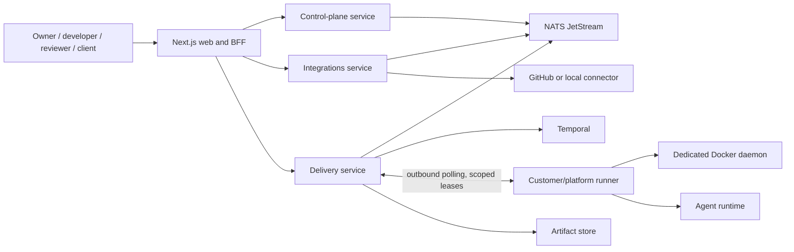

# Architecture

## System context



## Bounded contexts

### Control plane

Owns tenant identity projections, memberships, clients, projects, intake, clarification history, specifications and versions, requirements, decisions, work items, project policy, and the cross-service audit read model.

### Integrations

Owns connector accounts/installations, authorized repositories, webhook deliveries, external-resource mappings, and provider operations. It may mint temporary provider credentials, but it never persists installation tokens.

### Delivery

Owns agent-provider configurations, secret references, budgets, runner pools and enrollment, executions and attempts, approval waits, verification evidence, artifact metadata, costs, and delivery results. Temporal workflows coordinate long-running state.

### Runner

Is independently deployable and connects outbound to delivery. It owns local agent availability, runner-local secret resolution, workspaces, isolated containers, normalized runtime events, and cleanup. It receives secret references and scoped credential leases rather than ordinary credentials in jobs.

## Dependency direction

Each Python deployable is organized as:

```text
domain <- application <- adapters <- entrypoints
```

The domain is pure Python. Application use cases depend on Protocol ports. Adapters translate storage, HTTP, messaging, workflow, provider and container behavior. Entrypoints assemble dependencies and expose transport.

## Coordination

- User-facing CRUD is routed directly to the owning service through the BFF.
- Aggregate changes and event outbox rows commit together.
- JetStream delivers versioned events at least once. Consumers use an inbox and idempotent handlers.
- `work_item.ready.v1` starts a deterministic Temporal delivery workflow.
- Workflow payloads contain identifiers; durable domain state, timeline data and artifacts remain in owned stores.
- Runner calls are outbound and lease-based. Agent execution never forms a long synchronous HTTP chain.

## Data ownership

Local Compose uses one PostgreSQL server to reduce developer overhead, but each service has a separate database and role. Application roles cannot access another service's database. Tenant-owned tables carry `organization_id` and enable row-level security.
